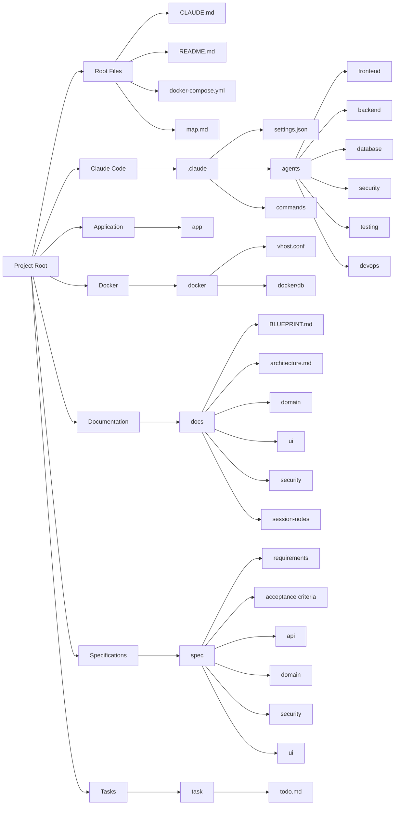

# Project Map — Structure & Responsibilities

Este documento es el **mapa oficial del proyecto**.  
Explica **qué hace cada carpeta**, **qué vive ahí**, y **cómo se usa dentro del flujo con Claude Code y Docker**.

Este proyecto sigue estos principios:
- Docker es obligatorio
- Claude Code es el motor de desarrollo
- La base de datos vive dentro del repositorio
- El diseño ocurre antes del código
- Claude ejecuta, no improvisa

---

## 🧠 Root del Proyecto

### `CLAUDE.md`
Archivo más importante del proyecto.

Define:
- reglas globales
- límites de edición
- estándares de código
- workflow con Claude Code
- permisos de herramientas

Claude Code lo carga automáticamente al iniciar.

---

### `README.md`
Descripción humana del proyecto:
- qué es
- cómo levantarlo con Docker
- requisitos básicos

---

### `docker-compose.yml`
Orquestador principal del entorno.

Responsabilidades:
- levantar aplicación
- levantar base de datos
- definir redes y volúmenes
- unificar entorno local / staging / dev

Todo el proyecto se ejecuta vía Docker.

---

## 🤖 Claude Code Configuration

### `.claude/`
Configuración exclusiva de Claude Code.

#### `.claude/settings.json`
- permisos
- modelos
- comportamiento global
- políticas del proyecto

---

### `.claude/agents/`
Subagentes especializados que **ejecutan trabajo**.

Cada agente:
- tiene una responsabilidad clara
- lee documentación específica
- escribe solo en áreas permitidas

Agentes actuales:
- `frontend.md` → UI / componentes
- `backend.md` → lógica de negocio / APIs
- `database.md` → esquema, migraciones
- `security.md` → permisos, autenticación
- `testing.md` → tests, validaciones
- `devops.md` → Docker, pipelines, despliegue

---

### `.claude/commands/`
Comandos reutilizables para Claude Code.

Ejemplos:
- setup inicial
- ejecutar tests
- desplegar

Evitan repetir prompts largos.

---

## 📦 Application Code

### `app/`
Código fuente de la aplicación.

Claude Code escribe aquí:
- frontend
- backend
- servicios
- lógica del sistema

Nunca contiene:
- reglas de negocio narrativas
- documentación
- decisiones de arquitectura

---

## 🐳 Docker Infrastructure

### `docker/`
Infraestructura Docker del proyecto.

#### `docker/vhost.conf`
Configuración de servidor web / proxy.

#### `docker/db/`
Base de datos del proyecto.

Responsabilidades:
- scripts de inicialización
- dumps
- seeds
- backups locales

La BD **vive dentro del repositorio**, pero se ejecuta vía contenedor.

---

## 📚 Documentation (`docs/`)

### `docs/BLUEPRINT.md`
Documento clave para Claude Code.

Contiene:
- visión del sistema
- arquitectura general
- roadmap
- fases de implementación

Claude Code lo usa en **Plan Mode** para crear el plan.

---

### `docs/architecture.md`
Arquitectura técnica detallada:
- capas
- componentes
- decisiones técnicas

---

### `docs/domain/`
Define el **lenguaje del negocio**.

Incluye:
- reglas de negocio
- casos de uso
- modelo de dominio
- modelo de datos
- glosario

Claude Code **lee**, pero no modifica sin instrucción.

---

### `docs/ui/`
Diseño de interfaces y experiencia de usuario.

Incluye:
- pantallas
- componentes
- flujos
- navegación
- wireframes (incluso desde bocetos a mano)

Fuente de verdad para frontend.

---

### `docs/security/`
Definición funcional de seguridad:
- roles
- permisos
- políticas de acceso

---

### `docs/session-notes/`
Registro cronológico de trabajo.

Cada sesión debe dejar:
- qué se hizo
- decisiones tomadas
- pendientes

Sirve para continuidad entre sesiones con Claude Code.

---

## 📐 Specifications (`spec/`)

`spec/` contiene **contratos estables**.

Diferencia clave:
- `docs/` explica
- `spec/` no se debe romper

---

### `spec/requirements.md`
Requisitos funcionales formales.

---

### `spec/acceptance-criteria.md`
Criterios de aceptación verificables.

---

### `spec/domain/`
Reglas e invariantes del negocio:
- invariants.md
- rules.spec.md

---

### `spec/api/`
Contratos de API:
- endpoints
- request / response
- validaciones

---

### `spec/security/`
Contrato de permisos y acceso.

---

### `spec/ui/`
Flujos de UI como contrato funcional.

---

## 🗂 Tasks

### `task/todo.md`
Backlog inicial del proyecto.

Claude Code puede:
- leerlo
- actualizarlo
- usarlo como guía de ejecución

---

## 🧭 Flujo recomendado de trabajo

1. Diseñar con el Arquitecto (ChatGPT)
2. Generar documentación (`docs/`, `spec/`, `CLAUDE.md`)
3. Iniciar Claude Code
4. Entrar en Plan Mode
5. Claude lee `BLUEPRINT.md`
6. Aprobar plan
7. Ejecutar con subagentes
8. Registrar avances en `session-notes`

---

## ✅ Regla de oro

> **Docker ejecuta**  
> **Claude Code desarrolla**  
> **Docs explican**  
> **Spec protege**  
> **Session-notes recuerdan**

